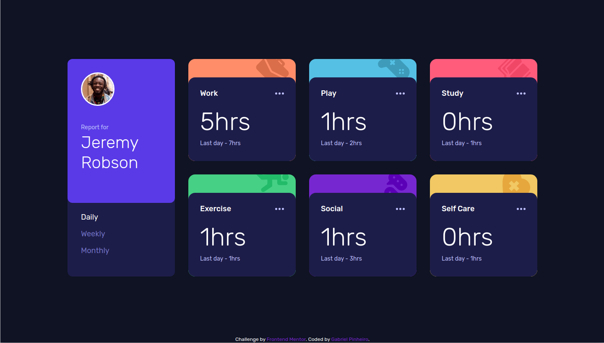
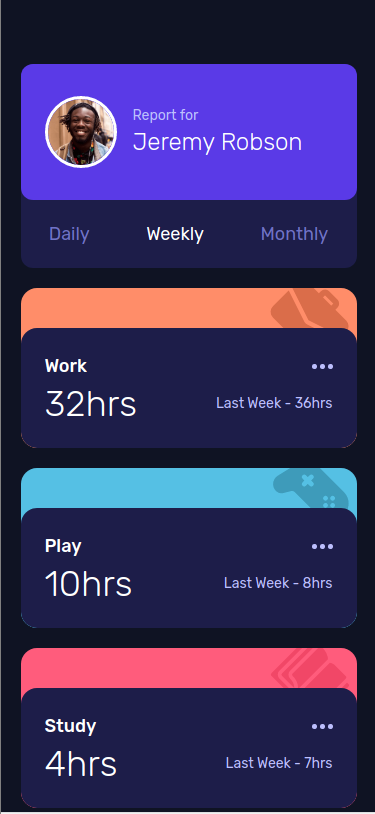

# Frontend Mentor - Time tracking dashboard solution

This is a solution to the [Time tracking dashboard challenge on Frontend Mentor](https://www.frontendmentor.io/challenges/time-tracking-dashboard-UIQ7167Jw).

## Table of contents

- [Overview](#overview)
  - [The challenge](#the-challenge)
  - [Screenshot](#screenshot)
  - [Links](#links)
- [My process](#my-process)
  - [Built with](#built-with)
  - [What I learned](#what-i-learned)
  - [Useful resources](#useful-resources)
- [Author](#author)

## Overview

### The challenge

Users should be able to:

- View the optimal layout for the site depending on their device's screen size
- See hover states for all interactive elements on the page
- Switch between viewing Daily, Weekly, and Monthly stats

### Screenshot

### Links

- Solution URL: [https://gabrielfmpinheiro.github.io/Time-tracking-dashboard/](https://gabrielfmpinheiro.github.io/Time-tracking-dashboard/)
- Live Site URL: [Add live site URL here](https://your-live-site-url.com)

## My process

### Built with

- Semantic HTML5 markup
- CSS custom properties
- Flexbox
- CSS Grid
- Mobile-first workflow
- [Tailwind](https://tailwindcss.com/) - Tailwind CSS

### What I learned

- How to use Tailwind CSS
- Improve Grid skills

### Useful resources

- [Install Tailwind](https://www.youtube.com/watch?v=h9Zun41-Ozc) - This video helped me to configurate the tailwind v3
- [https://www.youtube.com/watch?v=bxmDnn7lrnk&list=PL4cUxeGkcC9gpXORlEHjc5bgnIi5HEGhw&index=1](https://www.youtube.com/watch?v=bxmDnn7lrnk&list=PL4cUxeGkcC9gpXORlEHjc5bgnIi5HEGhw&index=1) - This is an amazing free course that helped to undestand how tailwind works
- [https://tailwindcss.com/](https://tailwindcss.com/) - This is the official tailwind documentation that helped me to find all features

## Author

- Linkedin- [Gabriel Pinheiro](https://www.linkedin.com/feed/)
- Frontend Mentor - [@GabrielFMPinheiro](https://www.frontendmentor.io/profile/GabrielFMPinheiro)
- Codewars - [@GabrielFMPinheiro](https://www.codewars.com/users/GabrielFMPinheiro)
